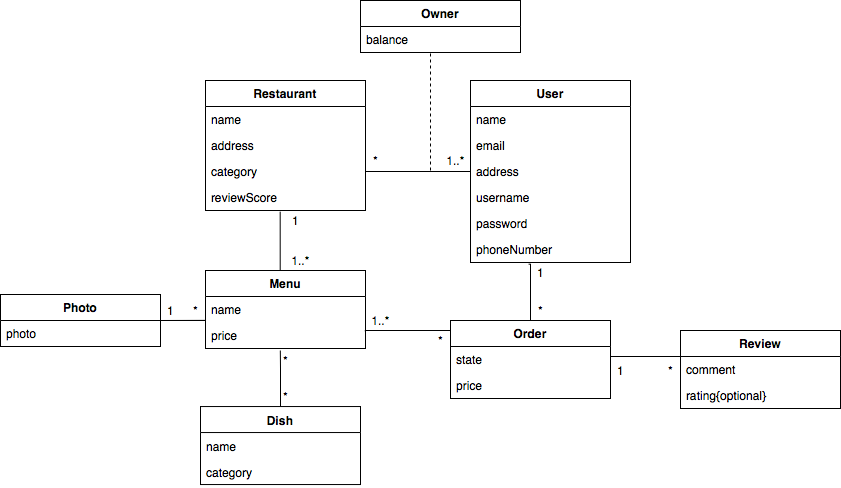

# ltw-t09-g03

## Database UML

## Running The project
 
To create the `database` and open the `server`:

- `$ make` 

Then [Click Here](http://localhost:5500/)

## Features

- [x] Register
- [x] Login/Logout
- [x] Edit Profile
- [x] Add Restaurant
- [x] Edit Restaurant
- [x] Add Dishes
- [x] Add Dish Photo
- [x] List Reviews
- [x] Restaurant Owner Can Answer to Review
- [x] List Customer Orders
- [ ] Change Order State
- [x] Search Restaurants
- [x] Order Dishes
- [x] List My Orders
- [x] Mark Restaurant as Favourite
- [x] Mark Dish as Favourite
- [x] Customer Can Leave a Review

## Credentials

# TBD
admin/test1
lapizzeria/lovepizza
johndoe/123456
